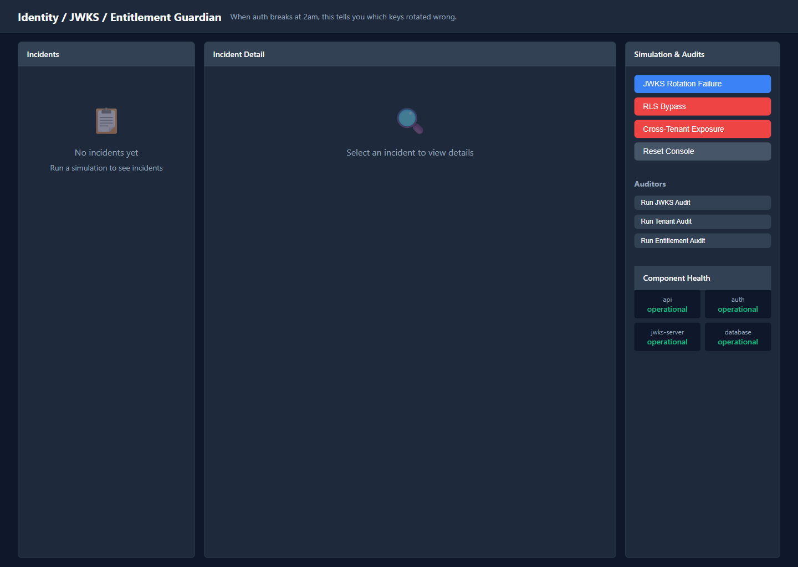
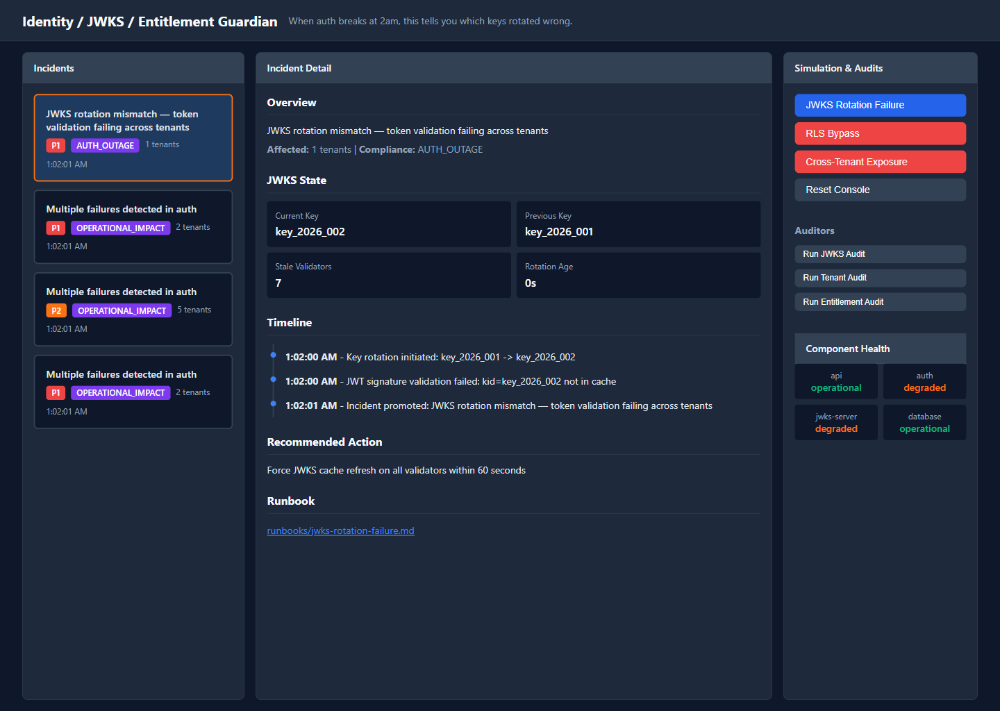

# Identity / JWKS / Entitlement Guardian

> When auth breaks at 2am, this is what tells you which keys rotated wrong and which tenants are exposed.

## Overview

Identity systems are deceptively complex. Tokens, keys, caches, tenants, roles — when something breaks, support engineers face a maze of subsystems, each with its own failure modes and compliance implications.

This repo demonstrates a support-first approach to identity incident management, reducing time-to-diagnosis for auth failures, tenant isolation breaches, and entitlement drift.

**Note:** This proof now includes enterprise identity support for SAML authentication troubleshooting and SCIM provisioning/deprovisioning workflows, using an Okta-style vendor flavor. This is a demo/mock implementation for support scenario training, not a real production integration.

## The Startup Pain This Solves

- **JWKS rotation failures locking out customers** — Stale cache validation, cascading auth failures
- **Cross-tenant data exposure** — Missing query filters, compliance breaches
- **Service role keys leaked in frontend bundles** — RLS bypass, potential data breaches
- **Hours of forensic work** — Scattered logs, unclear tenant impact, weak evidence capture

## What This Repo Demonstrates

- **Real-time JWKS rotation monitoring** — Detect stale cache validators before customers notice
- **Tenant isolation auditing** — Proactive checks for cross-tenant exposure
- **Entitlement drift detection** — Monitor for privilege escalation
- **Security-grade evidence capture** — Immutable snapshots for incident review
- **Compliance-aware runbooks** — GDPR breach notification checklists, security escalation criteria

## Screenshots

### Empty State — Support Console
The support console shows an empty state when no incidents are active. Simulation buttons allow triggering identity-specific failure scenarios.



### Incident Detail View
When an incident is selected, the detail pane shows identity-specific evidence including JWKS state, affected tenants, timeline, and recommended actions.



## Architecture

```
┌─────────────────────────────────────────────────────────────┐
│  App-Under-Test                                             │
│  ┌─────────────┐  ┌──────────────┐  ┌─────────────────┐   │
│  │ API Server  │──│ JWKS Server  │──│ Tenant Store    │   │
│  │ (Port 3001) │  │ (Port 3002)  │  │ (RLS Simulation)│   │
│  └─────────────┘  └──────────────┘  └─────────────────┘   │
│        │                   │                                 │
│        └─────────events────┘                                 │
└────────────────────┬────────────────────────────────────────┘
                     │
                     ▼
┌─────────────────────────────────────────────────────────────┐
│  Intelligence Core                                          │
│  - Ingests events from runtime store                       │
│  - Correlates by dwell-time and correlation_key            │
│  - Promotes incidents at threshold (5+ events)            │
│  - Generates artifacts: incident.json, timeline, evidence  │
└────────────────────┬────────────────────────────────────────┘
                     │
                     ▼
┌─────────────────────────────────────────────────────────────┐
│  Support Console (Port 3003)                                │
│  - Live incident queue with severity badges                │
│  - Identity-specific evidence (JWKS state, tenants)        │
│  - Auditor buttons for proactive checks                    │
│  - Compliance runbooks with escalation criteria            │
└─────────────────────────────────────────────────────────────┘
```

All services communicate through a **file-backed runtime store** (`runtime/`), enabling real cross-process event ingestion, JWKS state tracking, and tenant isolation monitoring.

## Incident Scenarios

### 1. JWKS Rotation Failure

A signing key is rotated. New tokens are issued with the new key. Validators with stale JWKS cache reject the new tokens. Customers can't authenticate.

**Run:** Click "JWKS Rotation Failure" in UI or `npm run scenario:jwks-rotation`

**Expected:** P1 incident with auth=degraded, JWKS state showing current_kid vs. previous_kid, 7 stale validators, 10 affected tenants

### 2. RLS Bypass

A developer accidentally uses the service role key in a frontend bundle. RLS is bypassed. Any user can read any tenant's data.

**Run:** Click "RLS Bypass" in UI or `npm run scenario:rls-bypass`

**Expected:** P1 security incident with auth=down, exposed key location, 5 cross-tenant queries, compliance impact = DATA_BREACH_POTENTIAL

### 3. Cross-Tenant Exposure

A new feature introduces a query that doesn't include `tenant_id` filter. Tenant A's user runs the query and sees Tenant B's data.

**Run:** Click "Cross-Tenant Exposure" in UI or `npm run scenario:cross-tenant`

**Expected:** P1 compliance incident with vulnerable query name, missing filter, 8 affected requests, compliance impact = GDPR_ARTICLE_32_BREACH

### 4. SAML Configuration Drift

SAML authentication fails due to configuration drift between the Identity Provider (Okta-style) and the Service Provider. Multiple failure modes may occur: audience mismatch, stale certificate/signature validation, and attribute mapping failures.

**Run:** Click "SAML Config Drift" in UI or `npm run scenario:saml`

**Expected:** P1 incident with auth=degraded, SAML state showing audience status, signature validity, attribute mapping status, and Okta-style vendor flavor indicator

### 5. SCIM Provisioning Drift

SCIM sync between the identity provider and downstream application has drifted. Users may be missing expected permissions, have unauthorized access, or fail to provision/deprovision correctly.

**Run:** Click "SCIM Provisioning Drift" in UI or `npm run scenario:scim`

**Expected:** P1 incident with provision_status=drift, SCIM state showing provisioning/deprovisioning health, group sync status, and affected users with group membership drift

## Auditor Tools

Proactive audit scripts that can run independently or via the UI:

```bash
npm run audit:jwks       # Check JWKS rotation health
npm run audit:tenants    # Check tenant isolation
npm run audit:entitlements # Check permission consistency
npm run audit:saml       # Check SAML configuration health
npm run audit:scim       # Check SCIM provisioning health
```

Each auditor generates a dated report in `artifacts/audits/` with pass/fail checks and specific details.

## Quick Start

### Prerequisites
- Node.js 18+

### Install and Run

```bash
# Install dependencies
npm install

# Reset runtime state
npm run reset

# Start all services
npm run start:all

# Open support console
open http://localhost:3003
```

### What to Watch For

1. **JWKS server** starts on port 3002, generates initial key
2. **API server** starts on port 3001, validates JWTs
3. **Intelligence core** polls for events every 1 second
4. **Support console** shows empty state initially
5. Click a **simulation button** (JWKS, RLS, Cross-Tenant, SAML, or SCIM) to trigger an incident
6. **Click incident card** to see identity-specific evidence in detail pane

### Reset Between Demos

```bash
npm run reset
```

## How to Test

```bash
# Unit tests (23+ tests)
npm test

# Integration tests (16+ tests)
npm run test:integration
```

Tests cover:
- Correlation and promotion logic
- Evidence capture with identity-specific fields
- Timeline and summary generation
- Runtime store (JWKS state, tenant state, SAML state, SCIM state)
- All 5 scenarios end-to-end
- All 5 auditors
- Reset→Simulate flow

## Artifact Outputs

Each promoted incident generates four artifacts in `artifacts/incidents/<id>/`:

| Artifact | Purpose |
|----------|---------|
| `incident.json` | Structured incident record with origin, severity, affected tenants, compliance impact |
| `timeline.json` | Chronological event sequence from first failure to promotion |
| `evidence-bundle.json` | Immutable snapshot of JWKS state, auth failures, tenant violations at promotion time |
| `summary.md` | Support-friendly summary with recommended actions and runbook link |

## Built With

- **Node.js** — Runtime environment
- **jose** — Industry-standard JWT/JWKS library (real crypto, not mock)
- **Concurrently** — Multi-process startup
- **Vanilla JS/HTML/CSS** — Operator console UI (no frameworks)
- **Chalk** — Colored terminal output for auditors

## Why This Matters to Application Support

This repo proves that application support is not just ticket handling — it's **operational acceleration** for identity systems.

By structuring noisy auth failures into one actionable incident object with identity-specific evidence, support engineers can:

- **Diagnose faster** — Know which key rotated, which tenants are affected, which validators have stale cache
- **Preserve evidence** — Immutable snapshots before transient failures disappear
- **Escalate appropriately** — Compliance-aware runbooks for security incidents
- **Reduce toil** — Proactive auditing instead of reactive firefighting

The patterns demonstrated here — event-to-incident separation, identity-aware correlation, evidence snapshotting, and compliance-focused runbooks — are directly applicable to any SaaS dealing with auth failures and tenant isolation.

## Disclaimer

This is a **demo/mock proof** for support scenario training. The SAML and SCIM features simulate Okta-style enterprise identity workflows but do not integrate with real Okta or any other identity provider. This is not a production-ready integration.

## License

MIT
